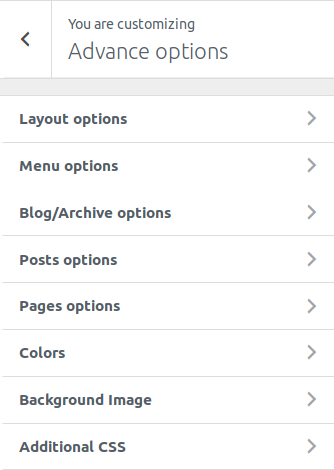
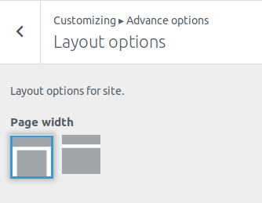
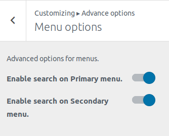
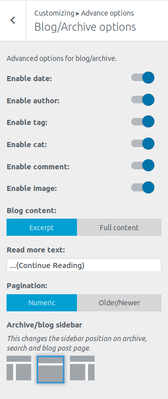
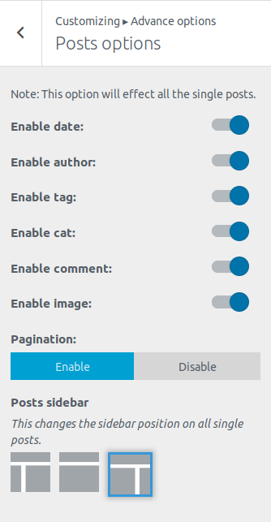
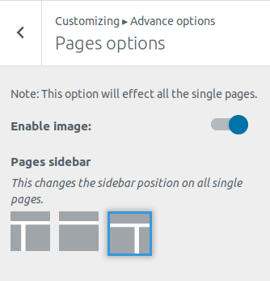
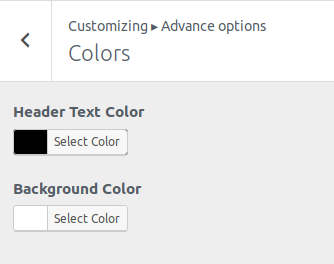
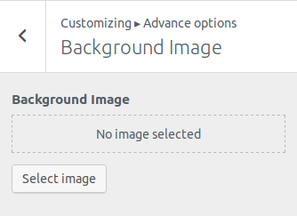

## Advanced options
First go to **Appearance->Customize.** Then click **Advanced options.**

This options provide some advanced option for layout, posts, pages and so on.

### Layout options
This provides option for overall width of the site.

Choosing the first one will apply container width to the container and choosing later will make the whole site full-width.

### Menu options
This option provides options to enable search on the menus.

You can toggle to enable search on the Primary or Secondary menu as your requirement.

### Blog/Archive options
Provides options for blog/archive pages in your site.

* **Enable date** in your archive page.
* **Enable author** in your archive page.
* **Enable tags** in your archive page.
* **Enable cat**(categories) in your archive page.
* **Enable comment** in your archive page.
* **Enable image**(Featured Image) in your archive page.
* **Blog content**: Whether to show excerpt or full content in your archive page.
* **Read more text**: If **Blog content** is excerpt, input text to show as read more text.
* **Pagination:** Whether to show numeric or older/newer pagination.
* **Archive/blog sidebar:** Whether to show sidebar on right or left or show no sidebar at all on your archive page.

### Posts options
Options for all the single posts in your site.

* **Enable date** in your single post.
* **Enable author** in your single post.
* **Enable tags** in your single post.
* **Enable cat**(categories) in your single post.
* **Enable comment** in your single post.
* **Enable image**(Featured Image) in your single post.
* **Pagination:** Whether to enable or disable pagination in your single post.
* **Posts sidebar:** Whether to show sidebar on right or left or show no sidebar at all on your single post.

### Pages options
Options for all the single pages in your site.

* **Enable image**(Featured Image) in your single post.
* **Pages sidebar:** Whether to show sidebar on right or left or show no sidebar at all on your single page.

### Colors

 
* **Header Text Color** changes your site title and tagline color.
* **Background Color** changes your site’s background color.

### Background Image

 
Change your site’s background with custom image.

### Additional CSS
Add your own CSS code here to customize the appearance and layout of your site.