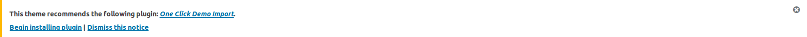

After activating theme, you may want to try out how the your site would look like with the theme. To make your site look like our [demo](https://demo.codemanas.com/code-manas/), follow as below: 

1. In your admin panel, you will see a notice as below: 

2. Install and activate [One Click Demo Import](https://wordpress.org/plugins/one-click-demo-import/) plugin as shown in the notice.
3. Then go to **Appearance**->**Import Demo Data**
4. Click **Import Demo Data** button. 

(*Note: It may take few minutes to import the data. Also for best result(images), make sure you are connected to the internet.*)

