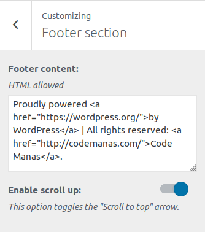

## Footer options

First go to **Appearance->Customize.** Then click **Footer sections.**

This option provides basic options for footer section.

* **Footer content:** Add footer content like copyright/privacy text. ***Note: Basic HTML tags are allowed.***
* **Enable scroll up:** This option toggles the “Scroll to top” arrow.
