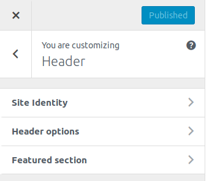
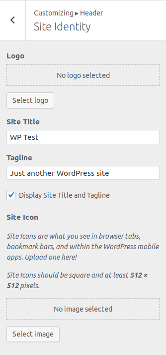
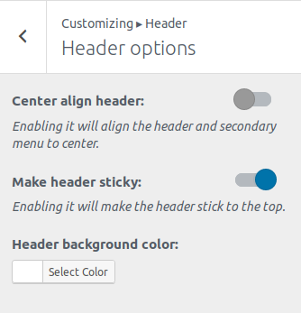
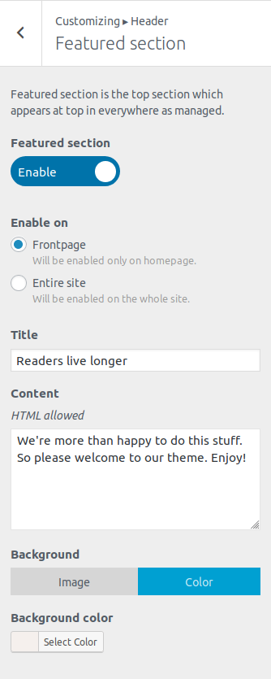

## Header options
First go to **Appearance->Customize.** Then click **Header**.

Then you will see the following options:

### Site Identity
This menu allows you to specify basic site information.

* **Logo** – Site logo image such as corporate symbol
Click Select Logo to open the Media Library. Select an image from it or upload the new image from Upload Files Tab screen and click Choose logo button at the bottom right.
Click Remove or Change logo to remove or change site logo image.
* **Site Title** – Text box for site title
* **Tagline** – Text box for tag line
* **Display Site title and tagline** – Checkbox to enable or hide the display of title and tag line
* **Site Icon** – The Site Icon is used as a browser and app icon for your site. Icons must be square, and at least 512 pixels wide and tall.
Click Select Image to open the Media Library. Select an image from it or upload the new image from Upload Files Tab screen and click Select button at the bottom right.

### Header Options

* **Center align header** – Enabling it will align the header and secondary menu to center.
* **Make Primary Menu sticky** – Enabling it will make the primary menu stick to the top.

### Featured Section
This section will enable you to show the featured section.

* **Featured section:** Switch it on to enable the Featured section
* **Enable on:** Selecting **Frontpage** will enable it only on homepage and **Entire Site** will show it all over the site.
* **Title:** Input the title of the Featured section.
* **Content:** Input the content of the section. ***Note: Basic HTML tags are allowed.***
* **Background:** You can set the background either: **Image or Color**. Selecting **Image** will prompt you with image uploader and **Color** will prompt with color picker.
